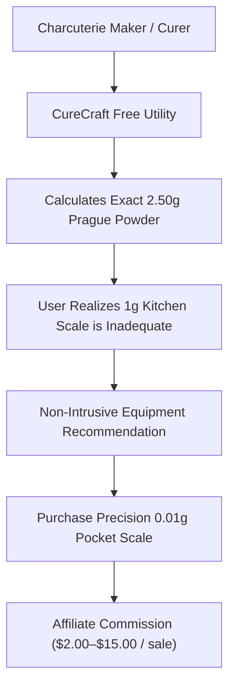

# CureCraft Monetization & Commercial Strategy

**Product:** CureCraft — Precision Meat Curing & Charcuterie Math Engine  
**Live URL:** `https://mohd34.github.io/curecraft/`  
**Philosophy:** Non-intrusive, utility-preserving monetization. Zero popups, zero intrusive banner ads, 100% focused on authentic practitioner tools.  

---

## 1. Organic Monetization Model Overview

In the artisan charcuterie and home curing niche, users have intense commercial purchase intent. Because curing meat is a biological and physical process requiring exact instrumentation, users actively seek recommendations for precision equipment:

---

## 2. Four-Pillar Monetization Strategy

### Pillar 1: High-Relevance Hardware & Supply Affiliate Integrations (Primary)
- **Concept:** When a user calculates an equilibrium cure, the app provides clean, non-intrusive hardware specifications:
  1. **0.01g Precision Digital Pocket Scales:** Essential for measuring curing salts safely (Amazon Associates / Culinary specialty retailers).
  2. **Heavy-Duty Vacuum Sealers & Rolls:** (FoodSaver, Anova, VacMaster) necessary for equilibrium curing bags.
  3. **Curing Chamber Dual-Stage PID Controllers:** (Inkbird ITC-308 Temperature Controller & IHC-200 Humidity Controller).
  4. **Starter Cultures & Casings:** (Bactoferm T-SPX, F-RM-52, natural hog and beef bung casings via The Sausage Maker / Butcher & Packer).
  5. **Deli Meat Slicers:** For paper-thin prosciutto and bacon slicing (Chef'sChoice, BESWOOD).
- **Projected Conversion Rate:** 2.5% – 4.0% of organic calculator visitors.
- **Average Commission:** $3.50 – $18.00 per referred hardware purchase.

### Pillar 2: Premium Digital Batch Journal & Printable Formulation Pack ($7.00 One-Time)
- **Concept:** A downloadable, beautifully formatted digital PDF & Notion Charcuterie Production Journal:
  - 50 pre-calibrated heritage recipe sheets (Traditional Tuscan Guanciale, Spanish Lomo Embuchado, Montreal Smoked Meat, Venetian Sopressa).
  - Chamber logging cards (Day-by-day weight loss tracking, pH decline curve, mold inoculation logs).
  - Printable butcher tags for curing chamber hanging hooks.
- **Delivery:** Delivered via Gumroad / Stripe checkout with zero friction.

### Pillar 3: Artisan Supplier Sponsorships & Brand Partnerships (Post-Traction)
- **Trigger:** When CureCraft reaches >10,000 monthly organic pageviews.
- **Concept:** Exclusive partner placement for premium butcher supply purveyors and clean-label spice importers (e.g. whole Tellicherry peppercorns, organic coriander seeds).
- **Format:** Single tasteful "Curated Equipment Partner" badge at the bottom of calculation specification cards.

### Pillar 4: B2B Commercial Smokehouse & Butcher Scaling Tool (SaaS Upgrade)
- **Concept:** Multi-batch batch scaler with HACCP compliance logs, lot-number tracking, and automated USDA FSIS regulatory documentation for small commercial charcuterie producers.
- **Model:** $19/month subscription for verified commercial smokehouse compliance.

---

## 3. Strict Quality Guardrails

1. **Never Paywall Core Mathematical Formulas:** All calculators (dry cure, wet brine, weight loss, curing time, biltong, nitrite converter) remain 100% free and open forever.
2. **Zero Popups or Modal Interstitials:** No email gates or intrusive countdown timers.
3. **Transparent Disclosure:** All affiliate links clearly marked with `rel="sponsored nofollow"` in compliance with FTC and Google search guidelines.
