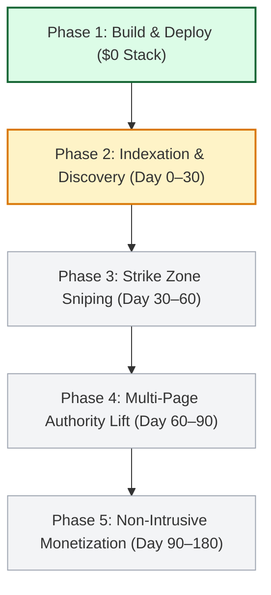

# CureCraft Strategic Development & SEO Growth Roadmap

**Project:** CureCraft — Precision Meat Curing & Charcuterie Math Engine  
**Live URL:** `https://mohd34.github.io/curecraft/`  
**Current Phase:** Phase 1 (Production v1.0.0 Deployed — SEO Freeze & Measurement Loop)  

---

## 🗺️ Multi-Stage Milestone Trajectory

---

### Phase 1: Research, Architecture & Production Build (COMPLETED)
- [x] Independently investigate 20 micro-niches; select Charcuterie & Curing Math.
- [x] Live SERP validation confirming defunct status of `diggingdogfarms.com`.
- [x] Author pure mathematical calculation engine (`assets/js/calculators.js`).
- [x] Pass 38/38 mathematical formula tests (100%).
- [x] Build 6 core interactive tools: Dry Cure, Wet Brine, Drying/Weight Loss, Curing Time, Nitrite Converter, Biltong.
- [x] Author 3 authoritative educational guides.
- [x] Pass 81/81 technical SEO and structural audits (100%).
- [x] Deploy to GitHub Pages (`https://mohd34.github.io/curecraft/`).

### Phase 2: Indexation & Search Console Telemetry (Month 1: Day 0–30)
- [ ] Monitor initial Googlebot crawl passes of `robots.txt` and `sitemap.xml`.
- [ ] Verify indexation of all 12 submitted URLs in Search Console.
- [ ] Record exact date of first organic search impression (Milestone 3).
- [ ] Record exact date of first organic click (Milestone 4).
- [ ] Ingest unexpected search queries into `data/keywords.json`.

### Phase 3: Strike Zone Optimization & Controlled Testing (Month 2: Day 30–60)
- [ ] Identify all queries reaching Google positions 11–20 with >100 impressions.
- [ ] Execute Experiment EXP-004 (Strike Zone Sniping Protocol).
- [ ] Refine title tags and meta descriptions for target query snippet alignment.
- [ ] Track CTR lift over 14-day observation windows.

### Phase 4: Topical Authority Expansion (Month 3: Day 60–90)
- [ ] Publish advanced charcuterie batch calculators (Fermented Salami pH Drop, Cold Smoking Chamber Vapor Pressure).
- [ ] Strengthen internal contextual linking between guides and calculators.
- [ ] Achieve sustained organic traffic across at least 4 distinct calculator URLs.

### Phase 5: Organic Monetization Activation (Month 4+: Day 90–180)
- [ ] Deploy non-intrusive equipment recommendations (0.01g pocket scales, vacuum sealers, PID chamber controllers).
- [ ] Launch downloadable printable batch cards and heritage recipe pack ($7 one-time).
- [ ] Measure initial conversion rates and net revenue without altering free core utility.
