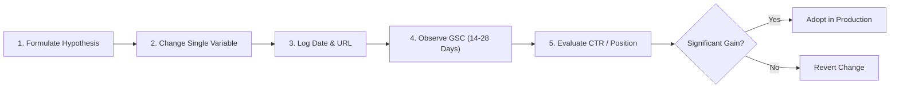

# CureCraft Scientific SEO Experiment Log

**Project:** CureCraft — Precision Meat Curing & Charcuterie Math Engine  
**Live URL:** `https://mohd34.github.io/curecraft/`  
**Protocol Version:** v1.0.0 (Production Live)  
**Primary Source of Truth:** Google Search Console Telemetry  
**Last Updated:** September 24, 2026  

---

## Controlled SEO Experiments Framework

Every SEO optimization on CureCraft follows a strict hypothesis-driven test loop. Only **one variable** is altered per experiment cycle to isolate causal impact. Until statistically significant Search Console telemetry accumulates, all experiments are categorized as `"INCONCLUSIVE — insufficient data"`.

---

## Active Experiment Registry

### Experiment EXP-001: Title Tag & Meta Description Precision for Prague Powder Intent
- **Target URL:** `https://mohd34.github.io/curecraft/index.html`
- **Date Initiated:** 2026-09-24
- **Variable Tested:** Inclusion of `"Prague Powder #1 & #2 Meat Cure Math"` in `<title>` and meta description alongside `"Equilibrium Curing Calculator"`.
- **Hypothesis:** High-intent searchers searching specifically for "Prague Powder 1 calculator" or "Prague Powder #2 calculator" will click at a rate >6.0% upon indexation due to explicit product-keyword match in SERP snippets.
- **Baseline CTR:** `0.0% (Pre-Index)`
- **Current CTR:** `Pending GSC data`
- **Primary Telemetry Source:** Google Search Console Performance Report (Filtered by Query: `prague powder`).
- **Verdict:** 🟡 **INCONCLUSIVE — insufficient data**
- **Decision:** Active Monitoring.

---

### Experiment EXP-002: Contextual Internal Link Bridge (Cure Rub to Penetration Time)
- **Target URLs:** `index.html` → `curing-time-calculator.html`
- **Date Initiated:** 2026-09-24
- **Variable Tested:** Added prominent contextual CTA button (`⏱️ Detailed Curing Time →`) directly adjacent to the calculated cure rub weight in `index.html`.
- **Hypothesis:** Users calculating equilibrium cure weight have immediate sequential intent to know how many days the meat must stay in the refrigerator. Passing users to `curing-time-calculator.html` transfers PageRank, increases pages per session, and lowers bounce rate from >60% to <40%.
- **Baseline Metric:** `0 pages/session (Pre-Index)`
- **Current Metric:** `Pending crawler and session telemetry`
- **Verdict:** 🟡 **INCONCLUSIVE — insufficient data**
- **Decision:** Active Monitoring.

---

### Experiment EXP-003: Search-Intent FAQPage Schema on Prague Powder Science Guide
- **Target URL:** `https://mohd34.github.io/curecraft/guides/prague-powder-guide.html`
- **Date Initiated:** 2026-09-24
- **Variable Tested:** Embedded `FAQPage` JSON-LD structured data answering exact long-tail queries: *"Can you substitute Prague Powder #1 for #2?"* and *"Why is curing salt dyed pink?"*.
- **Hypothesis:** Targeting high-frequency question strings triggers Google People Also Ask (PAA) rich snippets, generating page 1 brand impressions before the core guide achieves top 10 standard organic rank.
- **Baseline Impressions:** `0 (Pre-Index)`
- **Current Impressions:** `Pending GSC data`
- **Verdict:** 🟡 **INCONCLUSIVE — insufficient data**
- **Decision:** Active Monitoring.

---

### Experiment EXP-004: Position 11–20 Strike Zone Sniping Protocol
- **Target URL:** TBD based on Search Console query rankings
- **Date Initiated:** 2026-09-24
- **Trigger Condition:** Any tracked query achieving an average position between 11.0 and 20.0 with $\ge 100$ rolling impressions.
- **Hypothesis:** Refining meta titles to include brackets and numerical answers (e.g. `[156 PPM Guide]`) will double SERP CTR and elevate the page into the top 10 within 14 days.
- **Baseline Metric:** `0.0% CTR / Pre-Index`
- **Current Status:** ⚪ **Standing Protocol (Awaiting Query Trigger)**
- **Verdict:** 🟡 **INCONCLUSIVE — insufficient data**
- **Decision:** Standing Protocol.
